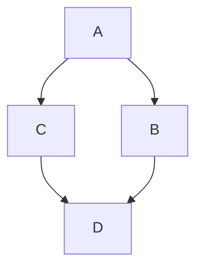

# 任务管理器 (TaskManager)
通过它运行多线程任务，支持优先级，取消和暂停

可创建多种任务类型：
- ActionTask：执行简单操作的任务
- BatchTask：按顺序执行多个任务
- DependentTask：依赖于其他任务完成后才执行的任务
- CompositeTask：执行相互有复杂依赖关系的多个任务(有向无环图)
- FunctionTask：执行有返回值的函数

支持四种优先级：
- Low：可以无限期等待的后台任务
- Normal：大多数任务的默认值
- High：需要立即处理的任务
- Critical：必须立即处理的紧急任务
eg. 没有Critical任务时，High任务被分配完后才开始分配Normal和Low任务到工作线程

创建任务后，使用`TaskManager.Instance.EnqueueTask(GameTask);`将任务入队等待执行

下面演示如何创建任务

### ActionTask
```C#
var actionTask = new ActionTask(() => {
    // 执行某些操作的语句
}, "任务名称", TaskPriority.Normal);
```
### BatchTask
```C#
var task1 = new ActionTask(() => GD.Print("执行任务1"), "任务1");
var task2...
var batchTask = new BatchTask("任务名称", TaskPriority.High, task1, task2, task3);
```
### DependentTask
```C#
var dependentTask = new DependentTask(
    () => GD.Print("所有依赖的任务已完成，现在执行依赖任务"),
    "任务名称", TaskPriority.High, prerequisiteTask1, task2...
);
```
### CompositeTask
假如需要任务按如下依赖关系运行，箭头指示任务的运行顺序

```C#
var compositeTask = new CompositeTask("复合任务名称", TaskPriority.Normal)
    .AddTask(taskA)
    .AddTask(taskB)
    .AddTask(taskC)
    .AddTask(taskD)
    .AddDependency(taskA, taskB)  // B依赖于A
    .AddDependency(taskA, taskC)  // C依赖于A
    .AddDependency(taskB, taskD)  // D依赖于B
    .AddDependency(taskC, taskD)  // D也依赖于C
    .Build();  // 构建任务图并检查循环依赖
```
### FunctionTask
```C#
// 创建一个带int型返回值的FunctionTask
var functionTask = new FunctionTask<int>(() => {
    // 一些耗时操作...
    return 42; // 返回结果
}, "任务名称", TaskPriority.Normal);

TaskManager.Instance.EnqueueTask(functionTask);

// 可以在之后获取结果（通常需要等待任务完成）
// 方法1：轮询检查任务状态
// 方法2：使用依赖任务处理结果
var resultHandlerTask = new DependentTask(() => {
    int result = functionTask.Result;
    GD.Print($"计算结果: {result}");
}, "结果处理任务", TaskPriority.Normal, functionTask);

TaskManager.Instance.EnqueueTask(resultHandlerTask);
```